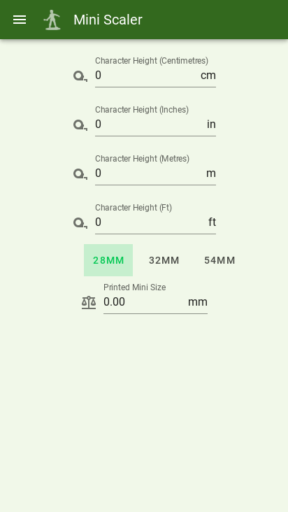
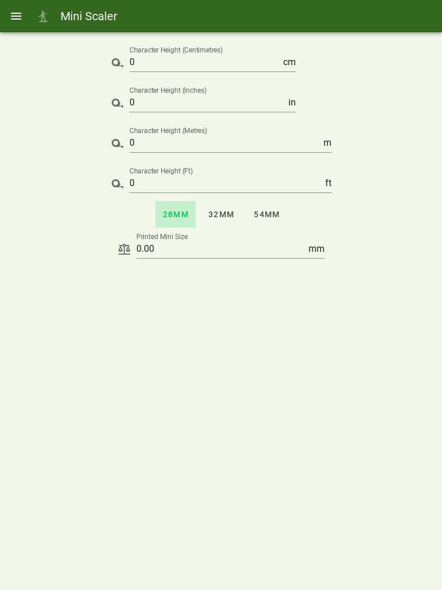

# Mini Height Scaler 
### A quick and easy way to ensure your 3D Printed Miniatures come out the right height. 

Allows for concurrent Unit Conversion across the Metric and Imperial Systems. Can convert miniatures for the 28mm, 32mm and 54mm Formats. 

Contains handy height reference menu for DnD and Warhammer 40k.


## Tech Stack:

* HTML/JS/CSS
* Vue.js
* Vuetify
* Hosted via AWS
* MaterialUI Icons
* Dependancies Compiled with Yarn


## Screenshots

#### Desktop


#### Mobile



#### Tablet



## Default Setup Stuff

### Project setup
```
yarn install
```

#### Compiles and hot-reloads for development
```
yarn serve
```

#### Compiles and minifies for production
```
yarn build
```

#### Lints and fixes files
```
yarn lint
```

#### Customize configuration
See [Configuration Reference](https://cli.vuejs.org/config/).
